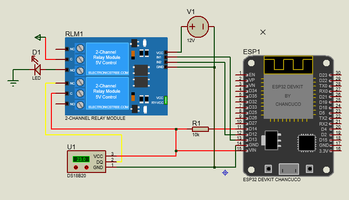
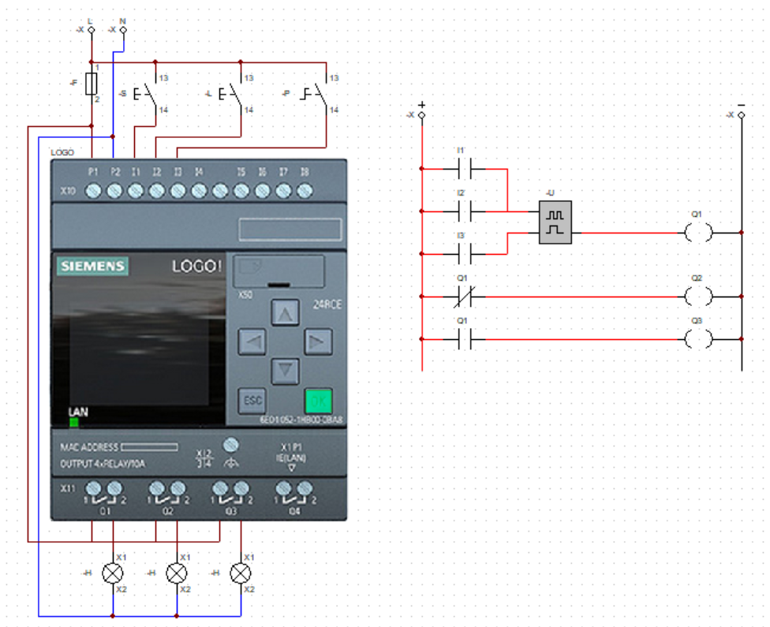

# Proyecto de Medición con ESP32 y PLC

Este proyecto integra un panel de control con ESP32, un sensor de temperatura DS18B20 y componentes de PLC. Incluye diagramas para Proteus, archivos de PLC y el código fuente de Arduino.

## Software necesario

- Proteus 8.17: para abrir `ESP32/ESP32 - Diagrama.pdsprj`
- Logo Soft Comfort 8.4: para abrir `PLC 230RCL/230 RCL - Diagrama de Bloques.lsc`
- Arduino IDE: para abrir y cargar `ESP32/ESP32.ino`
- Cadesimu: para abrir `PLC 230RCL/230 RCL - Diagrama de Fuerza.cad`

## Estructura del repositorio

- `ESP32/ESP32.ino` – código Arduino para el ESP32
- `ESP32/ESP32 - Diagrama.pdsprj` – proyecto de Proteus
- `PLC 230RCL/230 RCL - Diagrama de Bloques.lsc` – diagrama de PLC
- `PLC 230RCL/230 RCL - Diagrama de Fuerza.cad` – diagrama de fuerza (Cadesimu)
- `Recursos/ESP32.png` – imagen del proyecto ESP32
- `Recursos/PLC 230 RCL.png` – imagen del proyecto PLC

## Descripción general del proyecto

El ESP32 actúa como un servidor web en modo punto de acceso (AP). Al conectar un navegador a la red Wi-Fi creada por el ESP32, se muestra una interfaz SCADA para controlar una salida y visualizar temperatura y métricas de comunicación.

### Funcionalidad principal del ESP32

- Crea un punto de acceso Wi-Fi con SSID `Panel_de_Control` y contraseña `12345678`
- Expone una interfaz web en la IP del AP (normalmente `192.168.4.1`)
- Controla la salida de pulso para el foco en el pin `21`
- Controla el estado de corte de línea en el pin `19`
- Lee un sensor DS18B20 conectado al pin `27`
- Muestra en la web:
  - temperatura actual
  - ID del sensor DS18B20
  - tasa de error (BER)
  - throughput real
  - ancho de banda efectivo
  - disponibilidad del bus

### Cómo funciona `ESP32/ESP32.ino`

1. En `setup()` se configuran los pines de salida, se inicializa el sensor y se activa el AP.
2. Se inicia el servidor web con endpoints:
   - `/` para servir la página principal HTML
   - `/toggle` para generar un pulso de salida en el foco
   - `/corte` para cambiar el estado de la línea
   - `/datos` para entregar la información de sensores y métricas en formato JSON
3. En `loop()` el ESP32 maneja las conexiones web y realiza lecturas periódicas del sensor DS18B20 cada segundo.
4. Cuando la línea está cortada, el sistema marca la lectura como fallida y actualiza las métricas correspondientes.
5. Cada 5 segundos calcula el throughput y el ancho de banda en base a las lecturas exitosas.

## Interfaz web y controles

La interfaz incluye:

- botón `Pulsar` para activar la salida del foco
- interruptor `CORTAR LÍNEA` para simular un corte de bus
- visualizador de temperatura con color según estado
- tarjetas de parámetros con rangos y datos del sensor
- métricas de comunicación y disponibilidad del bus

## Instrucciones de uso

1. Abra `ESP32/ESP32.ino` en Arduino IDE.
2. Asegúrese de tener instaladas las librerías `WiFi`, `WebServer`, `OneWire` y `DallasTemperature`.
3. Cargue el código en el ESP32.
4. Conéctese al punto de acceso `Panel_de_Control` con contraseña `12345678`.
5. Abra un navegador e ingrese la IP mostrada en el monitor serie, normalmente `192.168.4.1`.

## Documentación y diagramas

- El diagrama de Proteus muestra el montaje del ESP32 y el sensor.
- El diagrama de bloques de PLC describe la lógica de control.
- El diagrama de fuerza muestra las conexiones eléctricas del PLC.

## Referencias visuales

## Notas adicionales

- El proyecto está diseñado para un entorno educativo de medición y control.
- Los archivos `*.lsc`, `*.pdsprj` y `*.cad` requieren sus respectivos programas para abrirlos correctamente.
- Asegúrese de mantener el cableado del sensor DS18B20 y las salidas de control bien aislados para evitar lecturas erróneas.
